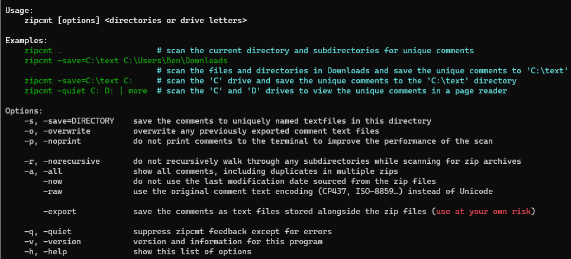

# zipcmt

[](https://pkg.go.dev/github.com/bengarrett/zipcmt) [](https://github.com/bengarrett/zipcmt/actions/workflows/release.yml)

Zipcmt is the super-fast batch, zip file comment viewer, and extractor.

- Using a modern PC with the zip files stored on a solid-state drive, zipcmt handles many thousands of archives per second.
- Comments convert to Unicode text for easy viewing, editing, or web hosting.<br>
<small>* comments can also be left as-is in their original CP437 or ISO-8859 text encoding.</small>
- Rarely see duplicate comments to avoid those annoying lists of identical site adverts.
- Transfer the source zip file's last modification date over to any saved comments.
- Tailored to both Windows and POSIX terminal platforms.

<video width="751" height="594" controls>
    <source src="preview.mp4">
</video>

## Downloads

<small>zipcmt is a standalone (portable) terminal application and doesn't require installation.</small>

- [Windows](https://github.com/bengarrett/zipcmt/releases/latest/download/zipcmt_Windows_Intel.zip)
- [macOS](https://github.com/bengarrett/zipcmt/releases/latest/download/zipcmt_macOS_Intel.tar.gz
), [or for the Apple M chip](https://github.com/bengarrett/zipcmt/releases/latest/download/zipcmt_macOS_M-series.tar.gz
)
- [FreeBSD](https://github.com/bengarrett/zipcmt/releases/latest/download/zipcmt_FreeBSD_Intel.tar.gz
)
- [Linux](https://github.com/bengarrett/zipcmt/releases/latest/download/zipcmt_Linux_Intel.tar.gz
)

### Packages

[APK (Alpine package)](https://github.com/bengarrett/zipcmt/releases/latest/download/zipcmt.apk)
```sh
wget https://github.com/bengarrett/zipcmt/releases/latest/download/zipcmt.apk
apk add zipcmt.apk
```

[DEB (Debian package)](https://github.com/bengarrett/zipcmt/releases/latest/download/zipcmt.deb)
```sh
wget https://github.com/bengarrett/zipcmt/releases/latest/download/zipcmt.deb
dpkg -i zipcmt.deb
```

[RPM (Red Hat package)](https://github.com/bengarrett/zipcmt/releases/latest/download/zipcmt.rpm)
```sh
wget https://github.com/bengarrett/zipcmt/releases/latest/download/zipcmt.rpm
rpm -i zipcmt.rpm
```

Windows [Scoop](https://scoop.sh/)
```sh
scoop bucket add bengarrett https://github.com/bengarrett/zipcmt.git
scoop install bengarrett/zipcmt
```

## Windows Performance

It is highly encouraged that Windows users temporarily disable **Virus & threat protection, Real-time protection**, or [create **Windows Security Exclusion**s](https://support.microsoft.com/en-us/windows/add-an-exclusion-to-windows-security-811816c0-4dfd-af4a-47e4-c301afe13b26) for the folders to be scanned before running `zipcmt`. Otherwise, the hit to performance is amazingly stark!

```
zipcmt -noprint 'C:\zipcmt examples\'
```

#### This is the expected performance on an SSD with a Windows Security Exclusion in place.

> Scanned 11331 zip archives and found 412 unique comments, taking 1.593534s

**1.6 seconds** to scan 11,000 zip archives.

#### This is the time taken with the default Microsoft Defender settings in use.

> Scanned 11331 zip archives and found 412 unique comments, taking 1m38.9398945s

**1 minute and 38 seconds** to scan the same 11,000 zip archives!

## Usage



## Example usage
#### Scan and print the comments
```sh
zipcmt test/

#  ── test/test-with-comment.zip ───────────┐
#    This is an example test comment for zipcmt.
#
# Scanned 4 zip archives and found 1 unique comment
```

#### Only print the comments
```sh
zipcmt --quiet test/

#   This is an example test comment for zipcmt.
```

#### Scan and save the comments

Linux, macOS, etc.

```sh
zipcmt --noprint --save=~ test/

# Scanned 4 zip archives and found 1 unique comment

cat ~/test-with-comment-zipcomment.txt

#   This is an example test comment for zipcmt.
```

Windows PowerShell

```powershell
zipcmt --noprint --save="C:\Users\Ben\Documents" .\test\

# Scanned 4 zip archives and found 1 unique comment

cat "C:\Users\Ben\Documents\test-with-comment-zipcomment.txt"

#   This is an example test comment for zipcmt.
```

## Build

[Go](https://golang.org/doc/install) supports dozens of architectures and operating systems letting zipcmt to [be built for most platforms](https://golang.org/doc/install/source#environment).

```sh
# clone this repo
git clone git@github.com:bengarrett/zipcmt.git

# access the repo
cd zipcmt

# target and build the app for the host system
go build

# target and build for Windows 7+ 32-bit
env GOOS=windows GOARCH=386 go build

# target and build for OpenBSD
env GOOS=openbsd GOARCH=amd64 go build

# target and build for Linux on MIPS CPUs
env GOOS=linux GOARCH=mips64 go build
```
